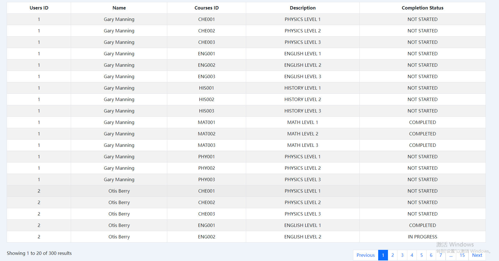
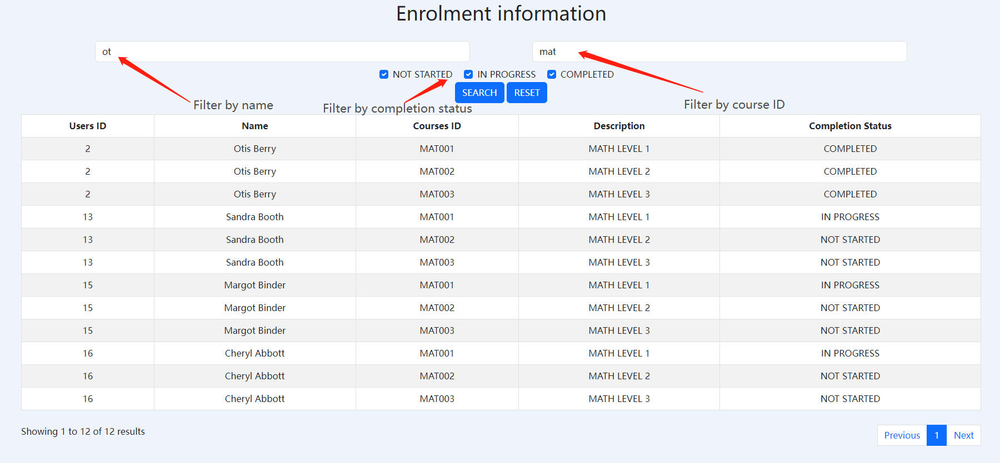
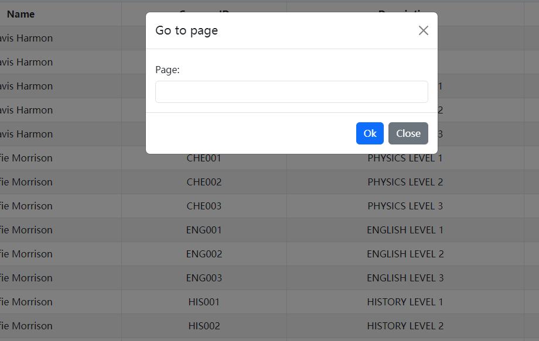

## Deployment:
Step 1:
Move everything into the folder where the web server will be reading and hosting the files
Locally I used Wampserver for development, I put it under the ```www``` folder

Step 2: 
Find the sql script in the **database** folder, run the script to import the database locally.

Step 3:
In the **controllers** folder, please open the ```databaseConfig.php``` file which contains the database connection information. Set the ```$password``` to your local database password.

Now the system should be running. Locally, I access the server by the following link:
http://localhost/MindAtlas/PHP_Student_Enrolments

## System Information:
The system displays enrolment information in a table with result separated in pages and each page contains 20 results.


Since the number of enrolments can be growing to very large number, the pagination of the query result is done on the backend(```studentEnrolment.php```).


Regarding pagination on the user interface, once the number of result pages reaches 15 pages, some of the pagination links will be hidden by ```...``` like it is shown in the following image.


Once the ```...``` is clicked, there will be a modal pop out for entering the page that the user wants to jump to like shown in the following image.

Input validation also applies to avoid invalid input or page number that is out of range.

## Features can be added:
1. Allow users to set or select page size of the table.
2. Users can be searched by their ID.
3. Allow users to change the way the result is sorted.